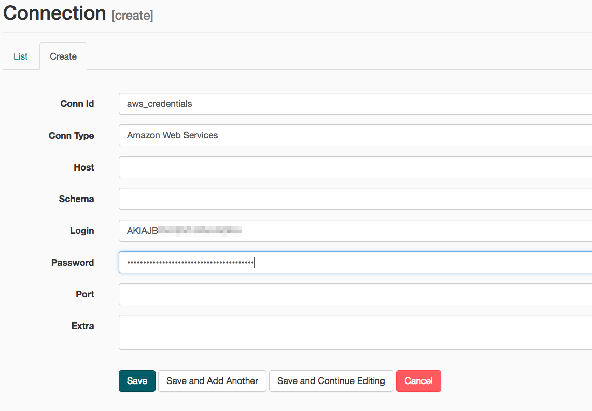

# Udacity DEND Project 4: Data Pipelines with Airflow
This is the fourth project in Udacity's Data Engineering Nanodegree. It is a data pipeline based on Apache Airflow. 

A music streaming company, Sparkify, has decided that it is time to introduce more automation and monitoring to their data warehouse ETL pipelines and come to the conclusion that the best tool to achieve this is Apache Airflow.

They have decided to bring you into the project and expect you to create high grade data pipelines that are dynamic and built from reusable tasks, can be monitored, and allow easy backfills. They have also noted that the data quality plays a big part when analyses are executed on top the data warehouse and want to run tests against their datasets after the ETL steps have been executed to catch any discrepancies in the datasets.

The source data resides in S3 and needs to be processed in Sparkify's data warehouse in Amazon Redshift. The source datasets consist of JSON logs that tell about user activity in the application and JSON metadata about the songs the users listen to.

## Datasets

There is two datasets in S3:
* Log data: ```s3://udacity-dend/log_data```
* Song data: ```s3://udacity-dend/song_data```

## Custom Airflow operators
In Apache Airflow, an operator represents a single, ideally idempotent, task. Operators determine what actually executes when your DAG runs.

In this project, some operators were created to perform, for instance, a copy from S3 bucket to Redshift table or a customize quality step.

### Stage Operator
This operator is able to load any JSON file from an AWS S3 Bucket to Amazon Redshift table. The operator creates and runs a SQL COPY statement based on the parameters provided. The S3 path and destinetion table should be specify to perform the operation.

### Act and Dimension Operators
This operators use a SQL helper class to run data transformations. Those transformations extract the dimension and fact tables from staged tables.

### Data Quality Checks
This operator is used to run checks on the data itself. The main functionality is to receive one or more SQL base test cases along with the expected results and execute the tests. For each the test, the test result and expected result needs to be checkect and if there is no match, the operator should raise and exception and the task should retry and fail eventually.

## DAG Configuration
This project is and Airflow DAG with the following steps.


## Add Airflow Connection
Here, we'll use Airflow's UI to configure your AWS credentials and connection to Redshift.

1. To go to the Airflow UI:
    * You can use the Project Workspace here and click on the blue **Access Airflow** button in the bottom right.
    * If you'd prefer to run Airflow locally, open http://localhost:8080 in Google Chrome (other browsers occasionally have issues rendering the Airflow UI).
2. Click on the **Admin** tab and select **Connections**.

3. Under **Connections**, select **Create**.

4. On the create connection page, enter the following values:
    * **Conn Id**: Enter ```aws_creadentias```
    * **Conn Type**: Enter ```Amazon Web Services```
    * **Login**: Enter your **Access Key ID** from IAM User credentials you downloaded earlier.
    * **Password**: Enter your **Secret access key** from the IAM User credentials you downloaded earlier.
    * Once you've entered these values, select **Save and Add Another**.

5. On the next create connection page, enter the following values:
    * **Conn Id**: Enter ```redshift```
    * **Conn Type**: Enter ```Postgres```
    * **Host**: Enter the endpoint of your Redshift cluster, excluding the port at the end. You can find this by selecting your cluster in the **Clusters** page of the Amazon REdshift console. See where this is located in the screenshot below. IMPORTANT: Make sure to **NOT** include the port at the end of the Redshift endpoint string.
    * **Schema**: Enter ```dev```. This is the Redshift database you want to connect to.
    * **Login**: Enter ```awsuser```.
    * **Password**: Enter the password you created when launching your Redshift cluster.
    * **Port**: Enter ```5439```.
    * Once you've entered these values, select **Save**
    
Awesome! You're now all configured to run Airflow with Redshift.